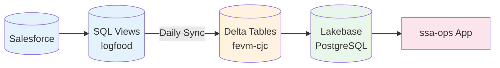

# SSA-Ops

A local-first data application built with TanStack Start, Radix UI, and Databricks Lakebase Autoscaling.

## Architecture

```
┌─────────────────┐     ┌─────────────────┐     ┌─────────────────┐     ┌─────────────────┐
│   Databricks    │────▶│    Lakebase     │────▶│   Electric SQL  │────▶│  TanStack DB    │
│   SQL Warehouse │     │  (Autoscaling)  │     │   (sync layer)  │     │  (local state)  │
└─────────────────┘     └─────────────────┘     └─────────────────┘     └─────────────────┘
```

**Key Features:**
- **Lakebase Autoscaling** - Managed Postgres with copy-on-write branching
- **Database-per-branch** - Every Git branch gets an isolated database fork
- **Auto-cleanup** - Feature branches auto-expire after 7 days
- **Scale-to-zero** - Idle compute suspends automatically

## Quick Start

### Prerequisites

- [Databricks CLI](https://docs.databricks.com/dev-tools/cli/index.html) v0.230+
- [pnpm](https://pnpm.io/) v9+
- [PostgreSQL client](https://www.postgresql.org/download/) (psql)
- [jq](https://stedolan.github.io/jq/) for JSON parsing

### 1. Clone and Install

```bash
git clone https://github.com/cchalc/ssa-ops.git
cd ssa-ops
pnpm install
```

### 2. Configure Databricks Profile

```bash
# Authenticate to your workspace
databricks auth login --host https://your-workspace.cloud.databricks.com --profile my-profile
```

### 3. Deploy Lakebase Autoscaling

```bash
# Validate bundle configuration
databricks bundle validate -t dev

# Deploy Lakebase project + read-replica
databricks bundle deploy -t dev
```

### 4. Run Post-Deploy Configuration

```bash
# Set environment variables
export LAKEBASE_PROJECT_NAME=ssa-ops-dev
export DATABASE_NAME=ssa_ops_dev
export DATABRICKS_PROFILE=my-profile

# Run migrations and configure permissions
./scripts/post_deploy.sh
```

### 5. Connect to Database

```bash
# Generate OAuth token (expires in 1 hour)
TOKEN=$(databricks postgres generate-database-credential \
  "projects/ssa-ops-dev/branches/production/endpoints/primary" \
  -p my-profile --output json | jq -r '.token')

# Connect with psql
PGPASSWORD="$TOKEN" psql \
  "host=YOUR_ENDPOINT.database.us-east-2.cloud.databricks.com \
   port=5432 user=your-email@example.com sslmode=require dbname=ssa_ops_dev"
```

### 6. Start Development Server

```bash
pnpm dev
```

Visit http://localhost:5173

## Replicating This Setup

### Step 1: Create Your Own Project

1. Fork or copy this repository
2. Update `databricks.yml` with your project name:
   ```yaml
   variables:
     lakebase_project:
       default: "your-project-name"
   ```

### Step 2: Configure GitHub Actions

Add these secrets to your GitHub repository:
- `DATABRICKS_HOST` - Your workspace URL
- `DATABRICKS_TOKEN` - PAT or service principal token

Add this variable:
- `LAKEBASE_PROJECT_NAME` - Your project name (e.g., `your-project-dev`)

### Step 3: Create Workspace Group

In your Databricks workspace:
1. Go to Settings → Identity and access → Groups
2. Create a group named `ssa-ops-developers` (or update scripts with your group name)
3. Add team members to the group

### Step 4: Deploy

Push to `main` branch to trigger deployment, or deploy manually:

```bash
databricks bundle deploy -t dev
LAKEBASE_PROJECT_NAME=your-project DATABASE_NAME=your_db ./scripts/post_deploy.sh
```

## Branching Workflow

```
main  ──push──▶  deploy bundle  ──▶  configure project  ──▶  run migrations
                      │
feature/*  ──create──▶  fork Lakebase branch from production (7-day TTL)
           ──delete──▶  delete Lakebase branch (auto-cleanup)
```

When you create a Git branch, GitHub Actions automatically:
1. Creates a Lakebase branch forked from production
2. Sets up a read-write endpoint with autoscaling
3. Configures 7-day TTL for auto-cleanup

When you delete a Git branch:
1. The corresponding Lakebase branch is automatically deleted
2. All endpoints and data are cleaned up

## Project Structure

```
ssa-ops/
├── .github/workflows/
│   ├── deploy-lakebase.yml        # Deploy on push to main
│   ├── create-lakebase-branch.yml # Auto-create database branches
│   └── delete-lakebase-branch.yml # Auto-cleanup database branches
├── infra/resources/
│   └── lakebase.yml               # Lakebase project + endpoints
├── scripts/
│   ├── post_deploy.sh             # Permissions, migrations
│   └── migrations.sql             # Schema definitions
├── src/
│   ├── db/collections/            # TanStack DB collections
│   ├── routes/                    # TanStack Router pages
│   └── components/                # React components
└── databricks.yml                 # Main bundle config
```

## Environment Targets

| Target | Project | Database | Compute |
|--------|---------|----------|---------|
| dev | `ssa-ops-dev` | `ssa_ops_dev` | 0.5-2 CU |
| staging | `ssa-ops-staging` | `ssa_ops_staging` | 0.5-4 CU |
| prod | `ssa-ops` | `ssa_ops` | 0.5-8 CU |

Deploy to a specific target:

```bash
databricks bundle deploy -t staging
databricks bundle deploy -t prod
```

## Manual Branch Operations

```bash
# Create a branch manually
databricks postgres create-branch "projects/ssa-ops-dev" "my-feature" \
  --parent-branch-id production \
  --ttl-duration "604800s"

# List branches
databricks postgres list-branches "projects/ssa-ops-dev"

# Delete a branch
databricks postgres delete-branch "projects/ssa-ops-dev/branches/my-feature"
```

## Known Limitations

- **Logical replication not supported**: Lakebase Autoscaling doesn't currently support `CREATE PUBLICATION` for tools like Electric SQL. Real-time sync requires polling or alternative approaches.
- **OAuth token expiry**: Tokens expire after 1 hour. Applications need token refresh logic.

## SSA Activity Dashboard

This repo includes SQL views and infrastructure for tracking SSA charter activities.

> **📐 See [docs/architecture.md](docs/architecture.md) for complete data flow diagrams (Mermaid)**

### Data Flow Overview



### SQL Views

| View | Purpose |
|------|---------|
| `cjc_team_summary` | Executive KPIs - open ASQs, overdue, capacity |
| `cjc_asq_completed_metrics` | Turnaround time, on-time delivery |
| `cjc_asq_sla_metrics` | SLA tracking per milestone |
| `cjc_asq_effort_accuracy` | Estimate vs actual comparison |
| `cjc_asq_reengagement` | Repeat account tracking |
| `cjc_asq_uco_linkage` | UCO linkage per ASQ |
| `cjc_asq_product_adoption` | Product adoption by account |

Deploy views:
```bash
# Run on central-logfood-prodtools-azure-westus
databricks sql execute -f sql/deploy_views.sql
```

### Dashboard Sections

- **Executive Summary** - Total open, overdue, capacity status
- **ASQ Lifecycle** - Status distribution, throughput trends
- **SSA Performance** - Per-person metrics, effort accuracy
- **Customer Engagement** - Account re-engagement, top accounts
- **UCO Linkage** - Business impact tracking
- **Product Adoption** - AI/ML, Lakeflow, Unity Catalog influence

See [docs/metrics-tree.md](docs/metrics-tree.md) for full view-to-metric mapping.

## Documentation

- **[docs/architecture.md](docs/architecture.md)** - Data flow diagrams (Mermaid), sync jobs, tables
- **[docs/testing.md](docs/testing.md)** - Data validation test suite
- [docs/metrics-tree.md](docs/metrics-tree.md) - View to metric mapping
- [docs/data-dictionary.md](docs/data-dictionary.md) - Field definitions
- [docs/REFERENCES.md](docs/REFERENCES.md) - External charter docs
- [PROJECT.md](PROJECT.md) - Development conventions
- [CLAUDE.md](CLAUDE.md) - AI assistant instructions
- [docs/electric-setup.md](docs/electric-setup.md) - Electric SQL setup (blocked by replication limitation)
- [docs/adr/](docs/adr/) - Architecture Decision Records

## Tech Stack

- **TanStack Start** - Full-stack React framework
- **TanStack DB** - Reactive client-side data
- **Radix UI** - Accessible components with themes
- **Capsize** - Pixel-perfect typography
- **Databricks Lakebase** - Managed Postgres with branching
- **Biome** - Fast linting and formatting

## License

MIT
