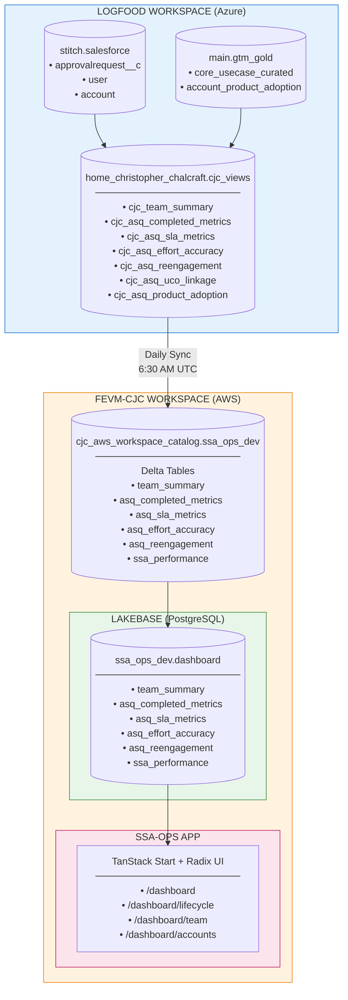
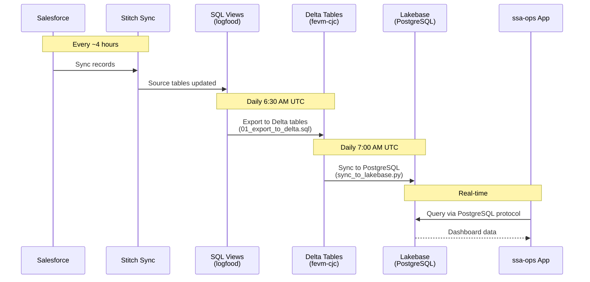
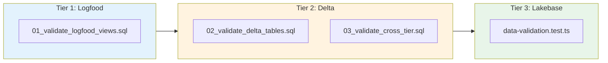

# SSA Activity Dashboard - Data Architecture

## Overview

The SSA Activity Dashboard uses a three-tier data architecture to sync data from Salesforce (via logfood) to a local-first web application.



## Data Flow Sequence



## Sync Jobs

```mermaid
gantt
    title Daily Sync Schedule (UTC)
    dateFormat HH:mm
    axisFormat %H:%M

    section Logfood
    Deploy Views          :06:00, 15m
    Export to Delta       :06:30, 20m

    section fevm-cjc
    Sync to Lakebase      :07:00, 15m

    section Validation
    Weekly Data Check     :milestone, 08:00, 0m
```



| Job | Schedule | File | Purpose |
|-----|----------|------|---------|
| Deploy Views | 6:00 AM UTC | `sql/deploy_views.sql` | Refresh SQL views |
| Export to Delta | 6:30 AM UTC | `sql/sync/01_export_to_delta.sql` | Copy to Delta tables |
| Sync to Lakebase | 7:00 AM UTC | `src/jobs/sync_to_lakebase.py` | Sync to PostgreSQL |
| Validate Data | Monday 8:00 AM | `sql/tests/*.sql` | Weekly validation |

## Tables & Fields

### Delta Tables (fevm-cjc)

| Table | Primary Key | Key Fields |
|-------|-------------|------------|
| `team_summary` | (single row) | total_open_asqs, overdue_asqs, completed_qtd |
| `asq_completed_metrics` | asq_id | owner_name, completion_date, days_total, delivered_on_time |
| `asq_sla_metrics` | asq_id | review_sla_met, assignment_sla_met, response_sla_met |
| `asq_effort_accuracy` | asq_id | estimated_days, actual_days, effort_ratio |
| `asq_reengagement` | account_id | total_asqs, engagement_tier, is_repeat_customer |
| `ssa_performance` | owner_name | total_open_asqs, overdue_count, pct_overdue |

## Test Strategy



| Test | File | Validates |
|------|------|-----------|
| View Smoke Test | `sql/tests/01_validate_logfood_views.sql` | Views exist, return data |
| Delta Validation | `sql/tests/02_validate_delta_tables.sql` | Tables synced, schema correct |
| Cross-Tier Check | `sql/tests/03_validate_cross_tier.sql` | Row counts match |
| Lakebase Tests | `tests/data-validation.test.ts` | Schema, freshness, integrity |

### Running Tests

```bash
# All tiers
./scripts/run-validation.sh all

# Specific tier
./scripts/run-validation.sh logfood
./scripts/run-validation.sh delta
./scripts/run-validation.sh lakebase
```

See [testing.md](testing.md) for detailed test documentation.

## Deployment Bundles

### Bundle 1: logfood (manual deployment)

```yaml
Purpose: Create/refresh SQL views with source data access
Target: home_christopher_chalcraft.cjc_views
Files: sql/views/*.sql, sql/deploy_views.sql
Note: IP ACL blocks automated deployment; run via SQL Editor
```

### Bundle 2: ssa-ops (DAB deployment)

```yaml
Purpose: App infrastructure + Lakebase + sync jobs
Target: cjc_aws_workspace_catalog.ssa_ops_dev
Profile: fevm-cjc
Resources:
  - Lakebase project (ssa-ops-dev)
  - Delta tables (synced from logfood)
  - Sync jobs (Delta → Lakebase)
  - Validation jobs
```

Deploy:
```bash
databricks bundle validate -t dev
databricks bundle deploy -t dev
```

## Access Patterns

| Access | Protocol | Auth | Latency |
|--------|----------|------|---------|
| SQL Views → Delta | Spark SQL | Unity Catalog | 10-30s |
| Delta → Lakebase | JDBC | OAuth | 5-15s |
| App → Lakebase | PostgreSQL | OAuth token | <100ms |

## Related Documentation

- [metrics-tree.md](metrics-tree.md) - View to KPI mapping
- [data-dictionary.md](data-dictionary.md) - Field definitions
- [testing.md](testing.md) - Test suite documentation
- [REFERENCES.md](REFERENCES.md) - External charter references
